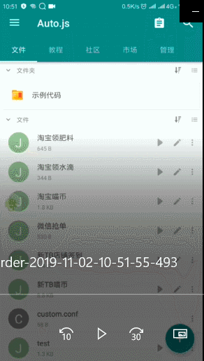

# 淘宝双11喵币

#### 主要功能  
自动点按式完成淘宝喵币收集，第三方工具 [Autojs](../../apk)

#### 重要信息
《[组件定制](./custom)》 《[测试模块](./test)》 《[全部流程](./custom/log_4.0.txt)》 《[3.x流程](./custom/log3.0.txt)》 《[旧版流程](./custom/log.txt)》

#### 重要更新
##### 11.09 更新 [直达更新](./release/淘宝喵币4.1.js)
1. 新增运行时组件失效提醒

#### 存在问题
1. 手机网络导致任务刷新不出来，无法保证100%完成
2. 英特尔店铺需要进入二层喵币页

##### 历史版本
* 《[淘宝喵币0.1](./release/history/淘宝喵币0.1.js)》 《[淘宝喵币1.0](./release/history/淘宝喵币1.0.js)》 《[淘宝喵币1.1](./release/history/淘宝喵币1.1.js)》 《[淘宝喵币1.2](./release/history/淘宝喵币1.2.js)》 《[淘宝喵币1.3](./release/history/淘宝喵币1.3.js)》
  * 基于坐标点击
  * 升级组件点击
  * 友好的提示信息
  * 增加浏览店铺签到
  * 修正淘宝组件更新
  * 增加任务最大极限时间
  * 多线程统计时间
  * 超时提醒手动操作
  * 更细致化提醒
* 《[淘宝喵币2.0](./release/history/淘宝喵币2.0.js)》 《[淘宝喵币2.1](./release/history/淘宝喵币2.1.js)》
  * 修正提示信息
  * 修复任务完成不跳转
  * 修正提示信息准确性
  * 更加灵活，组件定制
* 《[淘宝喵币3.0.1](./release/history/淘宝喵币3.0.1.js)》 《[淘宝喵币3.1](./release/history/淘宝喵币3.1.js)》 《[淘宝喵币3.2](./release/history/淘宝喵币3.2.js)》 《[淘宝喵币3.3](./release/history/淘宝喵币3.3.js)》
  * 定制组件，操作难度增加
  * 增加30个店铺签到功能
  * 界面启用UI设计
  * 兼容更多设备
  * 三天后重新定制组件
  * **首次使用需要定制组件**
  * 完善首页控制处理
  * 新增定制组件(主界面底栏的首页组件)，31个店铺
  * 更新提示，任务耗时统计
  * 新增店铺浏览滑动操作(仅安卓**7.0以上**设备)
  * **新特性即开即用**
  * 删除冗余代码
  * 新增[测试模块](./test)
  * 修复定制组件加载问题
* 《[淘宝喵币4.0](./release/history/淘宝喵币4.0.js)》
  * 基本实现了全自动化
  * [测试模块](./test)更新
  * 定制界面优化
  * 可以使用默认配置

#### 温馨提示
1. 使用过程中有一定的延时，可自行调整 <kdb> sleep() </kbd> 参数
2. 操作均由脚本自动跳转设置，勿自行切换页面
3. 如果页面长时间未反应，可自行进入活动页
4. 操作完成后会有提示，如果有提示未进行任务则不兼容

#### 致谢
@[DaYePython](https://github.com/DaYePython) 提供解决方案

#### 使用教程
1. 安装软件 [Autojs](../../apk)  
Autojs是一款安卓脚本自动化模拟用户点按操作apk
2. 导入js  
下载 [js](release) 脚本导入到Autojs中，点击运行即可。
3. 脚本效果   
   