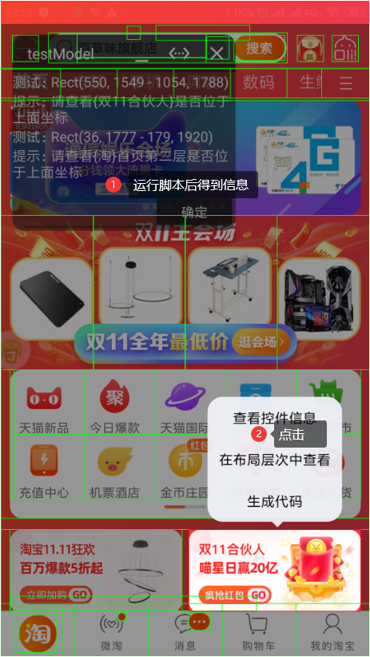
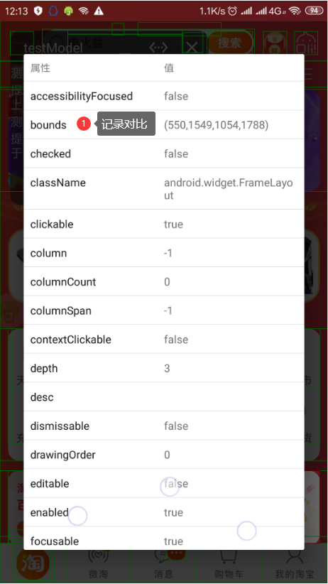
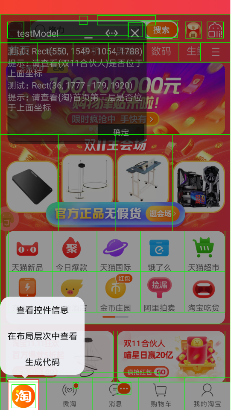
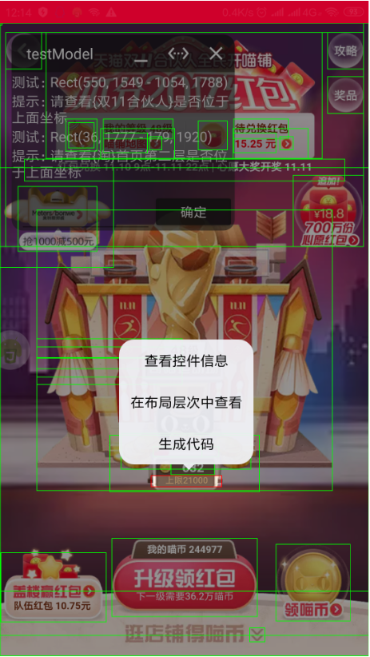
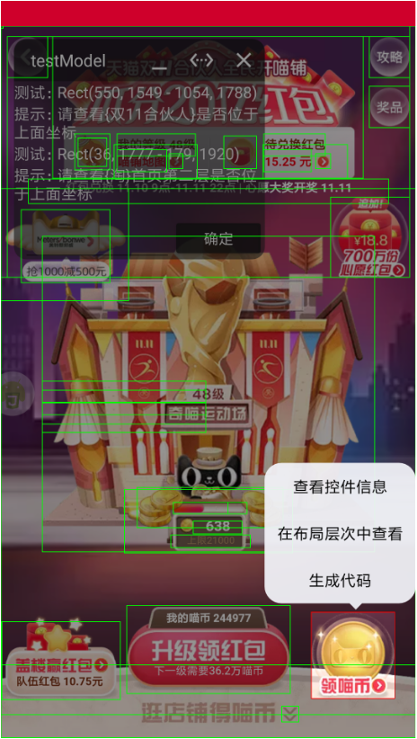
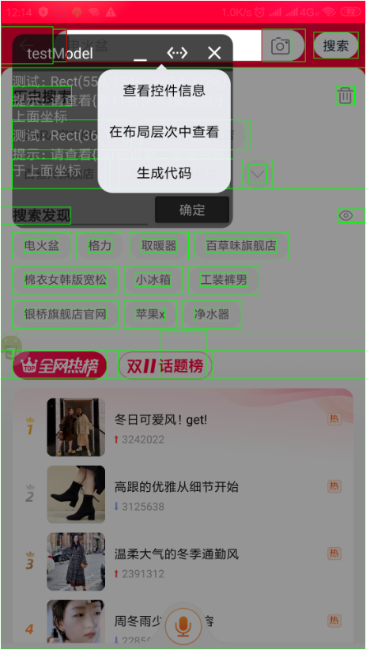

# 测试模块
### 重要更新 (10.08)
* 修复{淘}第二层组件识别问题

### 测试模块版本
* [testModel1.1](./testModel1.1.js)
* [testModel](./history/testModel.js)

### 主要组件
* 淘宝首页
    1. {双11合伙人}
    2. {淘}首页第二层
* 活动页
	1. {上限xxx}
	2. {领喵币}
* 搜索页
    1. {搜索页搜索框}

### 具体步骤
1. 定制好组件
2. 收到到指定页面运行
3. Rect信息组件bounds对比

### 图片操作 
     