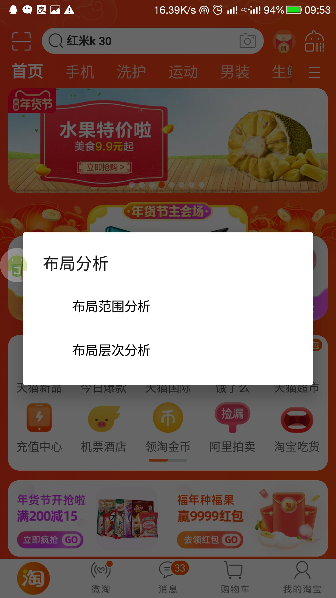
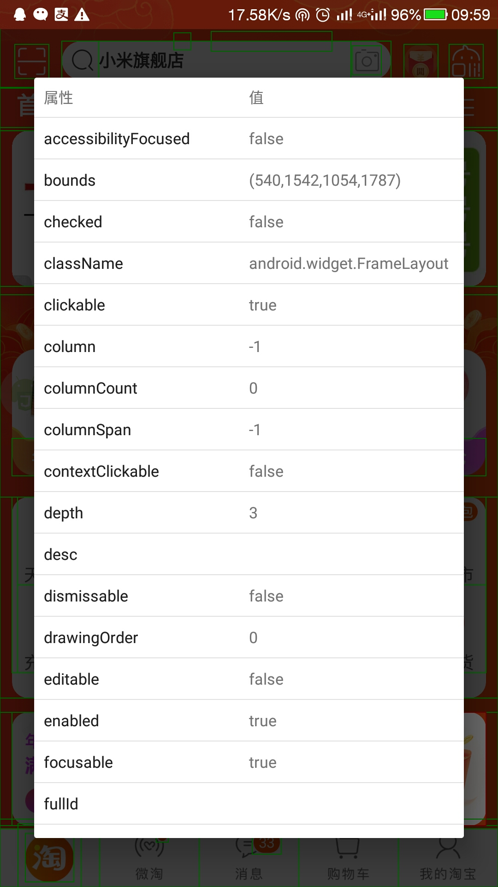

# 组件定制
自定义适配自己手机的组件

### 主要修改选项
* depth
* desc
* indexInParent
* clickable
* 注意：一般就修改其中一个即可

### 定制步骤
1. 打开AutoJS悬浮窗
2. 点击悬浮窗，启用布局分析（蓝色）
3. 点击失效组件查看空间信息
4. 注意 **主要修改选项** 里面的参数是否和配置一致
5. 修改配置的执行选项即可

### 图文并茂
      